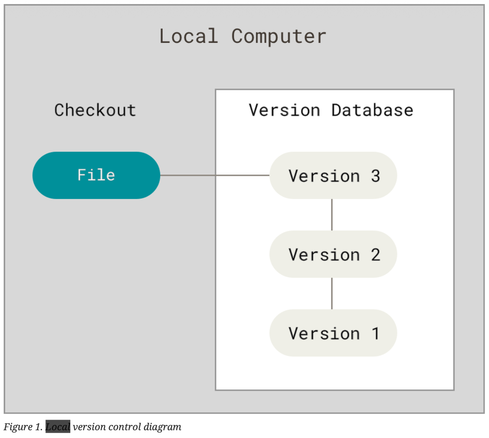
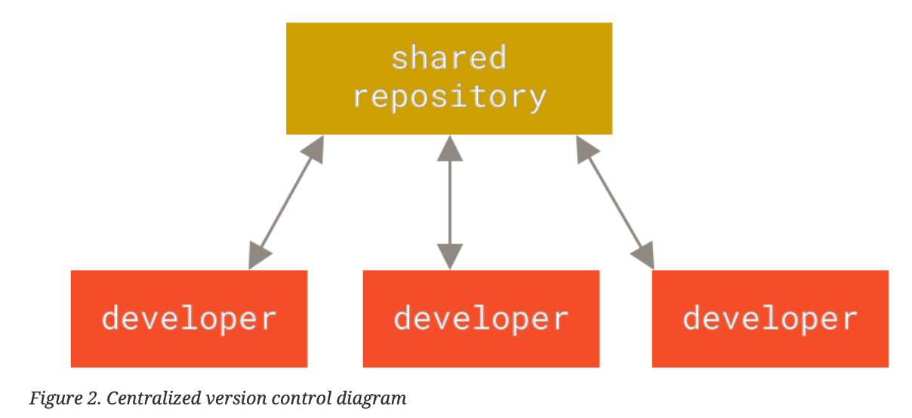
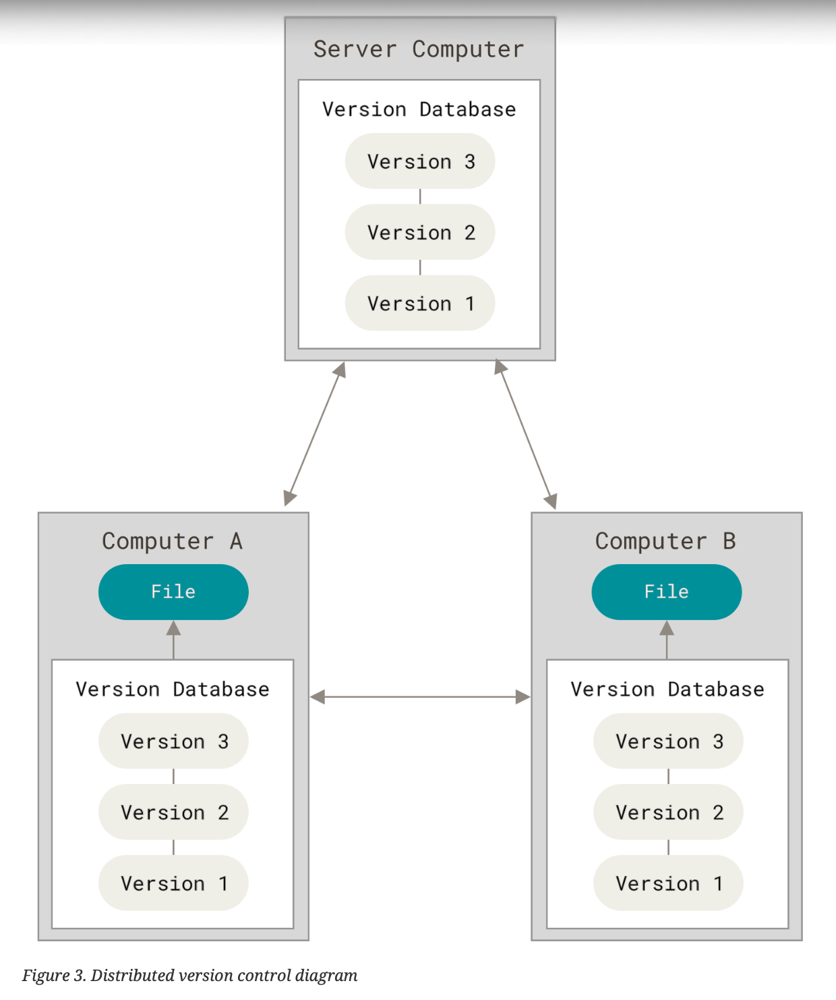

# About Version Control
**Version control system** is a system that records changes to a file or set of files over time so that you can recall specific versions later.
## Local Version Control Systems

## Centralized Version Control Systems

In centralized VCSs all versioed files are stored on a single server, so many users can collaborate at once. 

## Distributed Version Control Systems
In this model every participant, be it a server or a client, fully mirrors the repo, including its full history.

